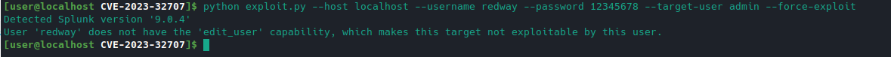
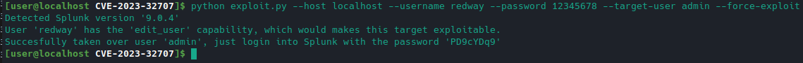
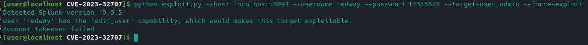

# CVE-2023-32707: Splunk 'edit_user' Capability Privilege Escalation

## Information
**Vendor Description**: A low-privileged user who holds a role that has the 'edit_user' capability assigned to it can escalate their privileges to that of the admin user by providing a specially crafted web request. This is because the 'edit_user' capability does not honor the 'grantableRoles' setting in the authorize.conf configuration file, which prevents this scenario from happening.  
**Versions Affected**: Splunk Enterprise 8.1.0 to 8.1.13, 8.2.0 to 8.2.10, and from 9.0.0 to 9.0.44.  
**Researcher:** [Santiago Lopez](https://twitter.com/santi_lopezz99)  
**Write-up Link:** Coming soon  
**NIST CVE Link:** https://www.cve.org/CVERecord?id=CVE-2023-32707  

---

## Proof-of-Concept Exploit
### Description
This exploit relies on an authorization issue within the Splunk Enterprise, which allows any user with the `edit_user` capability to take over the admin account (or any other chosen account) by providing a specially crafted web request.

### Usage

```bash
usage: exploit.py [-h] --host HOST --username USERNAME --password PASSWORD --target-user TARGET_USER
```

### Example

- When the user doesn't have the `edit_user` capability:


- Successful exploitation:


- When the Splunk is updated to a version that fixes the vulnerability:



